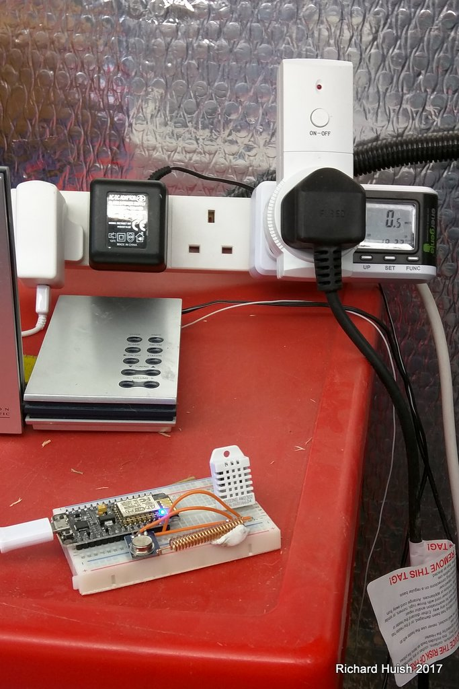

# Bunny-Shed-Climate-Control

## Matching Home Assistant Home Automation Hub Configuration

https://github.com/Genestealer/Home-Assistant-Configuration

## Info

  ## Code Header Copy

  Richard Huish 2015-2018

  Bunny shed heating controller using ESP8266 NodeMCU, 433Mhz transmitter, MQTT and Home Assistant

  ESP8266 based with local home-assistant.io GUI, 433Mhz transmitter for heater/fan control and DHT22 temperature-humidity sensor
    
  ----------
#### Key Libraries:
  
  ESP8266WiFi.h     // ESP8266 core for Arduino https://github.com/esp8266/Arduino
  
  PubSubClient.h     // Arduino Client for MQTT https://github.com/knolleary/pubsubclient
  
  RCSwitch.h        // RF control lib, https://github.com/sui77/rc-switch
  
  DHT.h          // DHT Sensor lib, https://github.com/adafruit/DHT-sensor-library
  
  Adafruit_Sensor.h // Have to add for the DHT to work https://github.com/adafruit/Adafruit_Sensor
  
  private.h        // Passwords etc not for github
  
  ESP8266mDNS.h     // Needed for Over-the-Air ESP8266 programming https://github.com/esp8266/Arduino
  
  WiFiUdp.h        // Needed for Over-the-Air ESP8266 programming https://github.com/esp8266/Arduino
  
  ArduinoOTA.h      // Needed for Over-the-Air ESP8266 programming https://github.com/esp8266/Arduino
  
  ArduinoJson.h    // For sending MQTT JSON messages https://bblanchon.github.io/ArduinoJson/
  

  ----------
  
 #### The circuit:
 
    NodeMCU Amica (ESP8266)
  
  Inputs:
  
    DHT22 temperature-humidity sensor - GPIO pin 5 (NodeMCU Pin D1)
    
  Outputs:
  
    433Mhz Transmitter - GPIO pin 2 (NodeMCU Pin D4)
    
    LED_NODEMCU - pin 16 (NodeMCU Pin D0)
    
    LED_ESP - GPIO pin 2 (NodeMCU Pin D4) (Shared with 433Mhz TX)
    
    ----------
    
  #### Notes:
  
  GUI: Locally hosted home assistant https://home-assistant.io
  
  MQTT: Locally hosted broker https://mosquitto.org/
  
  Over the Air Updates (OTA)
  
  NodeMCU LED lights to show MQTT conenction.
  
  ESP LED lights to show WIFI conenction.
  
  ----------  

  #### Edits made to the PlatformIO Project Configuration File:
  
      platform = espressif8266_stage 
      
  https://github.com/esp8266/Arduino/issues/2833 as the standard has an outdated Arduino Core for the ESP8266, ref http://docs.platformio.org/en/latest/platforms/espressif8266.html#over-the-air-ota-update
  
    build_flags = -DMQTT_MAX_PACKET_SIZE=512
    
  Overide max JSON size, until libary is updated to include this option https://github.com/knolleary/pubsubclient/issues/110#issuecomment-174953049    

---------- 

  #### Example Bill Of Materials
  - [NodeMCU Amica (ESP8266)](https://www.aliexpress.com/item/V3-Wireless-module-NodeMcu-4M-bytes-Lua-WIFI-Internet-of-Things-development-board-based-ESP8266-esp/32647542733.html)
   - [DHT22 temperature-humidity sensor](https://www.aliexpress.com/item/Free-shipping-DHT22-AM2302-replace-SHT11-SHT15-Humidity-temperature-and-humidity-sensor/1872664976.html)
   - [433Mhz ASK Transmitter](https://www.aliexpress.com/item/433MHz-100-Meters-Wireless-Module-Kit-ASK-Transmitter-STX882-ASK-Receiver-SRX882-2Pcs-Copper-Spring-Antenna/32637181317.html)
   - [Breadboard](https://www.aliexpress.com/item/1pcs-Quality-mini-bread-board-breadboard-8-5CM-x-5-5CM-400-holes/32803112223.html)
   - [Breadboard jumper wires](https://www.aliexpress.com/item/Packed-Breadboard-Line-Bread-Board-Jumper-140-pieces-Bread-Board-Cable/32647063474.html)
   - [Example remote control sockets](https://www.amazon.co.uk/Status-Remote-Control-Socket-Pack/dp/B003XOXAVG)
  
    
